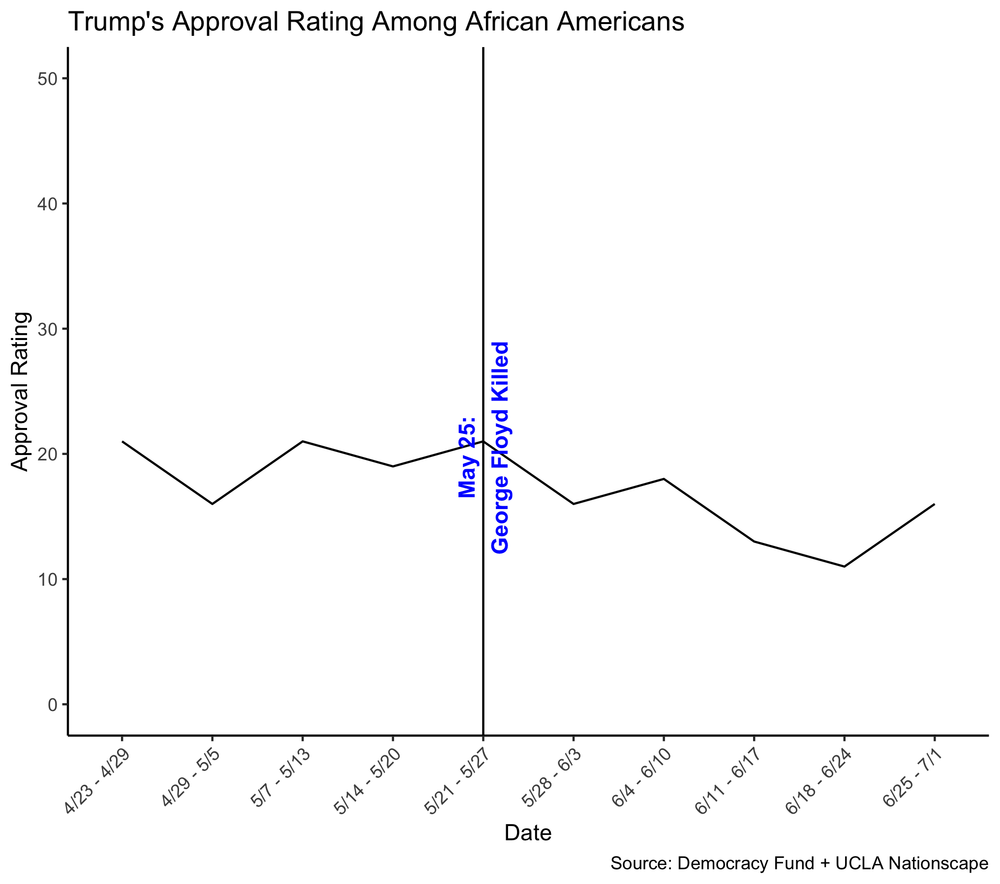
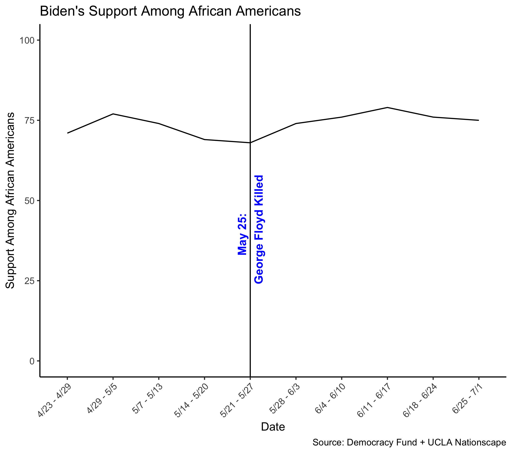
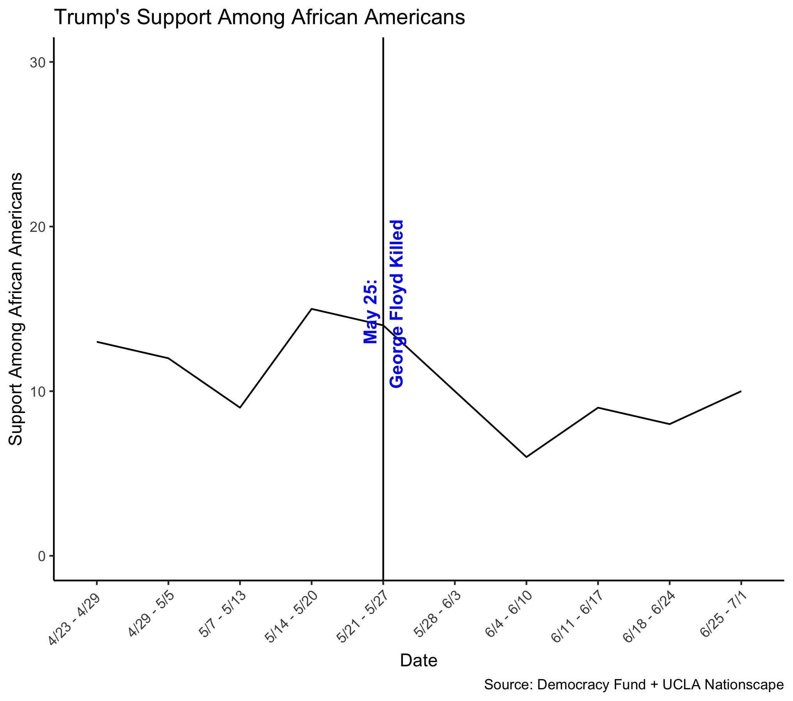

# 12/8 - Post-Election Narrative

## Overview

Now that the 2020 election is over, there is speculation as to why certain candidates performed the way they did. 2020 was a very unique year for the United States where there were numerous events like a global pandemic and social unrest that all had played a signficant role on the country. Moreover, I will be dedicating this blog post to a post-election narrative, which is a narrative by the media that is based on speculation rather than analysis. 

+ The narrative I chose is the immediate speculation that the **death of George Floyd** cost Donald Trump Black support in the election and may have played a signficant role in his loss to Joe Biden. 
+ The death of George Floyd and its impact on Trump's Black support has been an ongoing [narrative](https://www.cnn.com/2020/06/06/politics/trump-george-floyd-maine/index.html) in the media as many outlets and political scientists believe that Trump's response to the public outcry and social unrest that resulted from the death seemed **apathetic and disconnected to the American public** and thus negatively impacted his Black support. 
+ Many [news outlets](https://www.theguardian.com/us-news/2020/jun/01/george-floyd-donald-trump-black-lives-matter) deemed Trump as "clueless" in regards to the disadvantages faced by African Americans and his refusal to denounce white supremacy and police brutality clearly after the death may negatively impact him during the election and may cost him Black support.
+ Moreover, this narrative is important to test in the context of the various election-related variables we have discussed this semester in Gov 1347. One such election-related variable we learned was shocks. 
  + Just like how we studied the effects of the Covid-19 pandemic on the election outcome where the effects of the pandemic are considered a shock, we can also consider the bigger picture about the rise of racial tension after the death of George Floyd as a shock that can impact Trump's Black support. 
  + The racial tension is even more evident when you consider how Trump reacted to protests against racism and police brutality with [Federal Forces and apatheic diction](https://www.nbcwashington.com/news/national-international/trump-to-send-federal-agents-to-chicago-maybe-other-cities/2367006/) in his speeches afterwards.  

## Testable Implication

For this narrative, I will be using a testable implication. A testable implication does not necessarily involve a definitive test of the truth of the narrative, which involves difficult questions of casualty and unavailable data, but an implication that involves initial evidence that the data is consistent or inconsistent with claims. Therefore, the testable implication for this narrative is:

**If Trump's response to the death of George Floyd lost Black votes, then we should see a decrease in Black support for Trump post-death of George Floyd.**

This testable implication is justifiable for this narrative because a decrease in Black support for Trump does not definitely prove the claim that Trump's response to the death of George Floyd lost Black votes; however, a decrease in Black support could be a piece of evidence that Trump's response to the death of George Floyd lost Black votes. Moreover, this testable implication can be tested as there is data on Trump's approval ratings and support among African Americans before and after the death of George Floyd.

## Data Collected

The data I used for the testable implication was sourced from **Democracy Fund + UCLA Nationscape** where they have data on public opinions in the leadup to the 2020 election. Thus, the data I will be looking at is Trump's approval rating among African Americans before and after the death of George Floyd. Looking at this data can help us understand if Trump's support among Black people fell after the death of George Floyd as approval ratings are a good and fairly standard indicator of public support. In addition, this data can show patterns and trends to better analyze the testable implication. 

## Results

Figure 1. Trump's approval ratings among African Americans

+ According to Figure 1, we can see Trump's approval rating among African Americans leading up to the death of George Floyd and after the death of Geroge Floyd. We can see that his approval rating among African Americans **dropped somewhat sharply by 5 percentage points** (to 16%) right after the death. 
+ Furthermore, we can also see that his approval rating among Black people did not reach the same peak it did on 5/21 - 5/27, which was **21%**, given the available data.
+ Therefore, **the results of this test does support the narrative to a degree**. This is because we can see that his approval ratings decreased among Black people after the death, which may potentially have contributed to the outcome of the election. However, Trump's approval ratings started to increase on 6/18 where his approval rating reached **18% on 6/25 - 7/1**. 
  + This might mean that Trump's response to the death of George Floyd may not have had a very significant impact on Black support in the long run since his approval rating among African Americans was steadily increasing about a month after the death. 
  + This could also mean that Trump's loss in Black support after the death may have been temporary, evidenced by the sharp decline right after the death but a steady increase about a month after the death. 

## Additional Graphics and Analysis

Figure 2. Biden's support among African Americans

Figure 3. Trump's support among African Americans

Furthermore, we can not only look at Trump's approval rating among African Americans but also his support among African Americans. The graphs above shows the share of likely Black voters who support the respective candidate where Black voters have to choose between Biden and Trump or identify as undecided (data is also sourced from Democracy Fund + UCLA Nationscape). I decided to add a plot for Biden to further analyze if Biden's more [sympathetic response](https://www.nbcnews.com/politics/2020-election/biden-calls-racial-justice-during-emotional-george-floyd-funeral-speech-n1228566) can serve as a comparison. 

+ According to Figure 2 and Figure 3, we can see that while Trump lost support among African Americans right after the death of George Floyd, Biden seemed to gain support among African Americans. 
  + Support for Trump went from **14% during 5/21 - 5/27 to 10% during 5/28 - 6/3**. Support even dropped more on **6/4 - 6/10 to 6%**. Evidently, the results thus support the narrative to an extent. This is because even though Black support for Trump fell after George Floyd was killed, it seemed to be somewhat temporary as Trump's support among African Americans was steadily increasing about a month after the killing. Like Figure 1, Figure 3 seemed to show similar findings and further support the findings from Figure 1. 
  + Support for Biden, however, increased from **68% during 5/21 - 5/27 to 74% during 5/28 - 6/3**. Support increased even more on **6/11 - 6/17, reaching 79%**. The increase in support for Biden seems to support the narrative as well as it potentially serves as a piece of evidence that Trump's apathetic response to the killing of George Floyd may have taken a hit on his Black support whereas a more sympathetic response by Biden may have helped him with Black support. It is interesting to note that the increase in Black support for Biden after the death also seemed to be temporary, considering support among Black people for Biden seemed to be steadily decreasing about a month after the death. 
  
## Conclusion

The results of the test for the testable implication seem to offer initial evidence about the media narrative in the speculation that the death of George Floyd cost Donald Trump Black support in the election and may have played a signficant role in his loss to Biden. 
+ Trump's decline in approval rating and support among African Americans after the death can possibly be explained by what scholars have found about Black people where [they are more likely to view their racial identity and fate in a collective manner in comparison to other ethnic groups](https://fivethirtyeight.com/features/how-black-americans-view-their-racial-identity/). 
  + Thus, the killing of George Floyd and the protest and discourse about systematic racism that followed likely increased the [collective feelings](https://www.pewsocialtrends.org/wp-content/uploads/sites/3/2019/05/PewResearchCenter_RaceStudy_Topline_4.29.pdf) among Black people, which may help explain the results of the test for this media narrative. 
+ It is important to note, however, that the decline in Trump's support among African Americans following the killing of George Floyd appears to be temporary as Trump's approval rating and support among Black people seemed to steadily be increasing about a month after the death. This could thus serve as evidence that Trump's response to the death of Geroge Floyd may not have **signficantly** cost Black support in the long run. 

