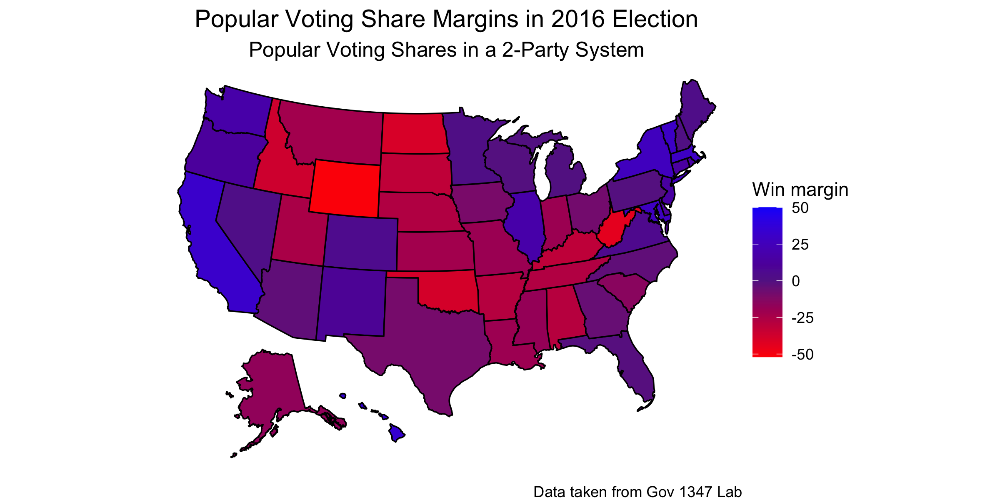
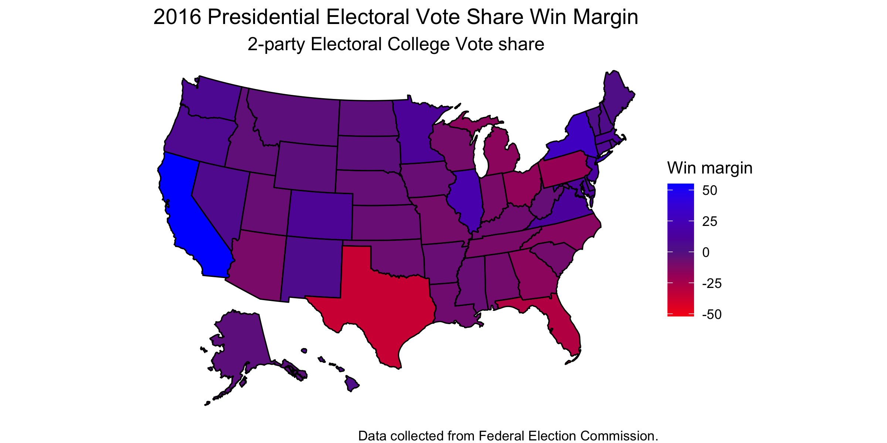

## 9/13 - Does the Electoral College Hurt Democrats?

The 2016 Election stood out mainly because it was one of the few cases where a candidate who lost the popular vote won the electoral college, thus winning the presidential bid. In all cases that this occurred, this only happened to Republican candidates with the exception of John Quncy Adams, who was a Democratic-Republican. However, since we are focused more heavily on modern presidential elections, we will keep this list as unianmously republican. This thus begs the question is the electoral college a detriment to the Democratic Party, especially in today's society and the future? 

To first answer this question, let's look at the patterns of the 2016 election. Below is a figure representing the popular voting margins among both democratic and republican parties. The more blue the state is, the more democratic it voted in terms of popular vote and the same holds true for the republican party where state are red instead. States that are very much in the middle are closer to a shade of purple. 

As we can see, much of America is actually quite purple, meaning swing states. According to FiveThirtyEight, about 25% of America is quite actually encompasses swing states. These states include Colorado, Florida, Iowa, Michigan, Minnesota, Nevada, New Hampshire, North Carolina, Ohio, Pennsylvania, Virginia, and Wisconsin as "perennial" swing states. What's interesting to note here, however is that states that are more blue tend to be metropolitan areas like California and New York, whereas states that are more red tend to be rural areas like Wyoming and Idaho. States like California and New York have about 25% more democratic voters, whereas states like Wyoming and Idaho also have about 25% more republican voters than the other party.

If we compare the popular voting margins to the elecotral college voting margins, the difference is quite noticeable. While the electoral college is a very binary way of looking at things, the map below demonstrates something very important, however. It demonstrates the somewhat consistency of the number of electoral votes on a state by state basis, given the large amount of purple seen. 

One thing to note is that since electoral college depends on the population of each state, it seems to be consistent in number through most of middle America. What's interesting to note is that states with the highest population and thus most electoral votes tend to be states on the border, such as California, Florida and Texas. According to the [United Nations](https://www.un.org/esa/sustdev/natlinfo/indicators/methodology_sheets/oceans_seas_coasts/pop_coastal_areas.pdf), a possible reason for this that there are superior economic benefit in coastal areas due to the expansion of fisheries, tourism, human settlements, and access to ocean navigation. 

