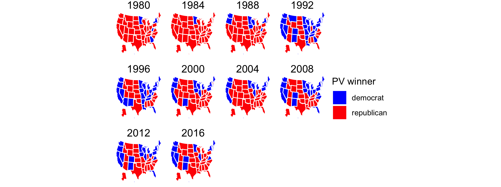

Tahmid Ahmed

The 2016 Election stood out mainly because it was one of the few cases where a candidate who lost the popular vote but won the electoral college won the presidential bid. In all cases that this occurred, this only happened to Republican candidates with the exception of John Quncy Adams, who was a Democratic-Republican. However, since we are focused more heavily on modern presidential elections, we will keep this list as unianmously republican. This thus begs the question is the electoral college a detriment to the Democratic Party, especially in today's society and the future? 

To first answer this question, let's look at the history of popular voting patterns in America. 

