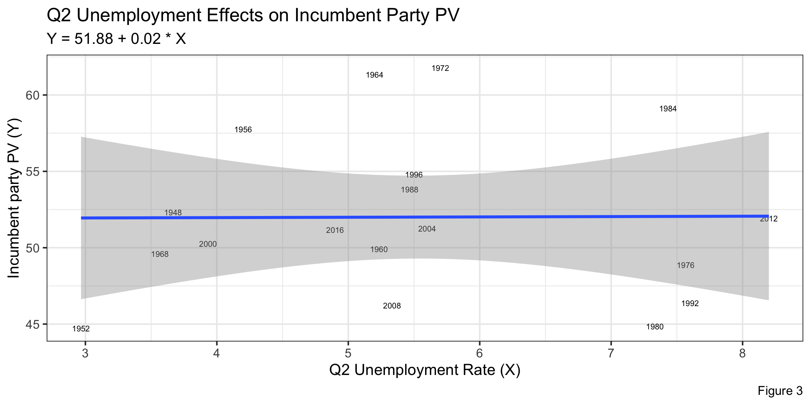
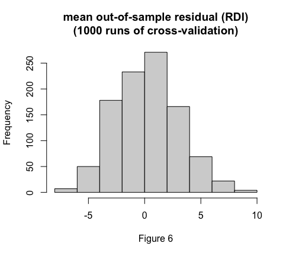

# 9/20 - How Does the Economy Affect Voting Behaviors?

### Overview
Historically speaking, the economy has remained a critical factor affecting how people vote. One can argue that how the economy is doing is not so much of a bipartisan issue: everyone wants a strong economy. Thus, given that the economy can play a signficant role in how citizens vote, let's analyze more in depth of how certain economic predictors, such as inflation and unemployment, can tell us more about voting behaviors in 2020. 

### Model 1: How Inflation Impacts the Incumbent Party Popular Vote Share?
In our first model, we will look at how inflation affects the incumbent party vote share. Since, we are focused mainly on the election timeline, we will look at Quarter 2 data. This is because Quarter 2 has recent economic data before the election date as opposed to Quarter 4, which has data after the election. Furthermore, the most recent and complete economic data in our dataset is the second quarter of the 2020 election. Thus, it makes sense to look at Q2 so we can make a prediction and compare it with the actual vote margin. 

In **Figure 1**, we can see that the relationship between inflation (an inflation index in this case) and the incumbent party vote share is negatively correlated. In this case, r = -.22 (of inflation index) and the residual error was 5.30, showing that the relationship between inflation and vote share is fairly strong. What this implies is that as inflation increases, voters are less likely to vote for the incumbent president. Logically, an increased rate of inflation means that the purchasing power of each unit of currency is reduced; thus, we may see an increase in prices of goods. Given that consumers are price sensitive, an increased prices can potentially lead to voters hesitant to vote for the incumbent president if inflation rates remain high. 

Furthermore, we can use cross validation with our data to make valid predictions of the vote share of 2020. Cross-validation essentially witholds a random subset of the sample of data we make, and fits the model with the rest of the sample. We can evaluate the predictive performance on the held-out observations, which involves repeatedly evaluating against many randomly held-out “out-of-sample” datasets. Rather than looking at one single evaluation, we can thus look at a distribution of evaluations. 

In **Figure 2**, we can see that mean of out-of-sample residuals are mostly around zero, so our prediction model should be valid. The following bullets tell us about our prediction model for 2020 vote margin for the incumbent party if we use inflation as an indicator: 

+ The mean difference between our prediction using out-of-sample validation and the true value (2016 election) is 0.97
+ The average error of the out-of-sample residuals is 2.00
+ Our prediction we get using out-of-sample validation is 49.75% with a 95% confidence interval of (37.08, 62.43)

### Model 2: How Unemployment Impacts the Incumbent Party Popular Vote Share?
In our second model, we will look at how unemployment affects the incumbent party vote share. Unemployment is a great indicator of how the economy is doing, and keeping it under control is one of the most important things the Federal Reserve does.

In **Figure 3**, we can see that the relationship between unemployment rate and the incumbent party vote share does not seem to be closely related. In this case, r = .006 (of unemployment), showing that the relationship between unemployment and vote share is not strong. This insinuates that voters seem to not be strongly affected by unemployment, which is surprising to be frank. Logically, higher unempoyment means that fewer people have jobs, so it appears that voting behaviors are not impacted too much by that. This could be because during periods of recession (when unemployment is high), voters may still vote for the incumbent because they may believe the incumbent can help the country get out of recession. 

Just like the previous model, we will also be doing a cross validation prediction model here. In **Figure 4**, we can see that mean of out-of-sample residuals are mostly around zero, so our prediction model should be valid. The following bullets tell us about our prediction model for 2020 vote margin for the incumbent party if we use unemployment as an indicator: 

+ The mean difference between our prediction using out-of-sample validation and the true value (2016 election) is -1.00
+ The average error of the out-of-sample residuals is 2.15
+ Our prediction we get using out-of-sample validation is 52.17% with a 95% confidence interval of (34.26, 70.09)

### Model 3: How Real Disposable Income Impacts the Incumbent Party Popular Vote Share?
In our third model, we will look at how real disposable income (RDI) affects the incumbent party vote share. RDI is another great indicator of how the economy is doing as it shows how much citizens make after tax. A higher average RDI is usually a strong indicator that GDP is high and inflation is relatively low as there is enough money being circulated to pay individuals a higher level and there is an increase of consumer spending. 

In **Figure 5**, we can see that the relationship between RDI and the incumbent party vote share seems to be slightly negatively correlated. In this case, r = -0.28 (of RDI), showing that the relationship between RDI and vote share is somewhat strong. This insinuates that voters seem to be negatively affected by an increase of RDI. This is very interesting, because when RDI increases that means consumers are spending more and inflation should be relatively flat or decrease. In a way, there is a discrepancy between this model and the first model as lower inflation implied higher vote share for the incumbent party; however, in this case higher RDI, which could possibly be due to lower inflation, may make voters less suspectible to vote for the incumbent. 

In **Figure 6**, we can see that mean of out-of-sample residuals are mostly around zero, so our prediction model should be valid. The following bullets tell us about our prediction model for 2020 vote margin for the incumbent party if we use RDI as an indicator: 

+ The mean difference between our prediction using out-of-sample validation and the true value (2016 election) is -0.60
+ The average error of the out-of-sample residuals is 2.22
+ Our prediction we get using out-of-sample validation is 52.17% with a 95% confidence interval of (34.26, 70.09)

### Conclusion

We have created three prediction models, using each of inflation, unemployment, and RDI as our indicators. Based on our models, it appears that the most accurate model was when RDI was an indicator as the difference between the prediction using the out-of-sample validation and true value was the smallest. However, even though the difference was the smallest, the RDI model did have the largest average error of out-of-sample residuals, which indicates that the model is possibly more volatile than the other models. The unemployment model had the largest difference between the predicted and true value, which made sense because unemployment rate and the incumbent's popular vote share seemed to have no correlation. Additionally, the models show that the economy plays a signficant role on voting behaviors. The different models indicate that my 2020 prediction is sensitive to changes of economic predictors, specifically inflation and RDI, because there was not only correlation between some economic predictors and the incumbent party's vote share, but also the residual errors of the models were quite small and significant. I am impressed by how close the models were with the true value, and this could be because we conducted many validations. Furthermore, I am interested to using a multivariate regression model next time, possibly using multiple independent variables to improve my model. This is because there are different dimensions of the economy, and it is important that a prediction model factors those dimensions. 

