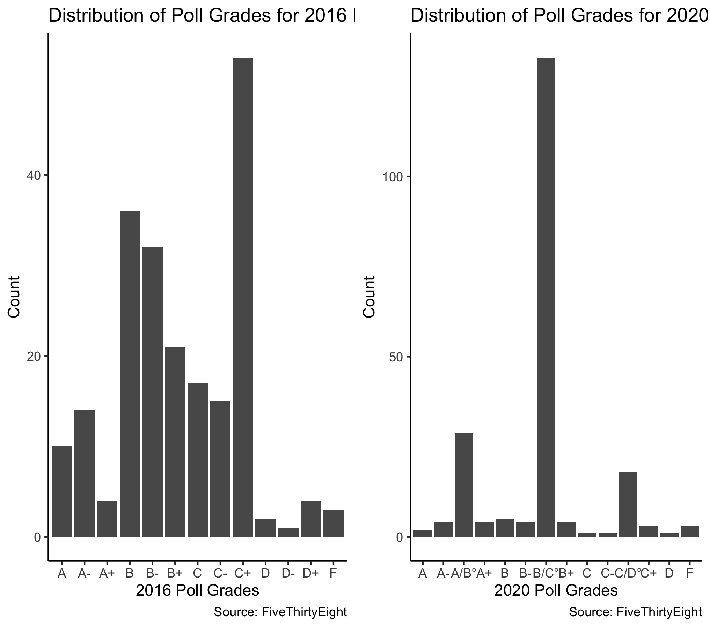
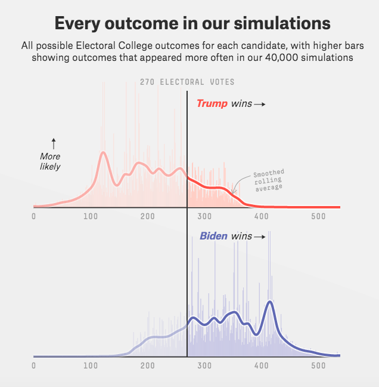
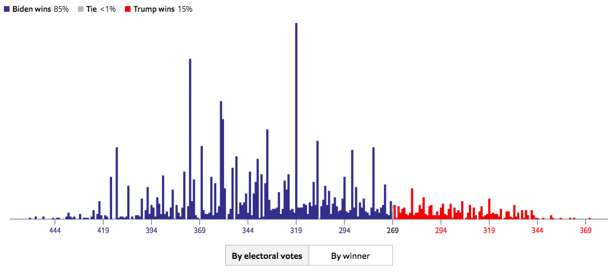

# 9/27 - Taking a Deep Dive into FiveThirtyEight and The Economist's Election Forecasts

## Overview
Election forecasts are often very volatile but they give citizens a sense of what the upcoming election may look like. Two such popular forecasts are [FiveThirtyEight's Presidential Forecast](https://projects.fivethirtyeight.com/2020-election-forecast/) and [The Economists' Presidential Forecast](https://projects.economist.com/us-2020-forecast/president). While both models share many similarities, they are both different: the FivethirtyEight model seems to place more of an emphasis on polls while The Economist's models appears to place more of an emphasis on fundamentals. For clarification, "fundamentals" are a political science term for structural factors (such as the economy and incumbency) that impact voter decisions. Let's take a deep dive into both models and evaluate which one is better. 

## How does FiveThirtyEight's model work?

### Step 1: Collect, analyze, and adjust polls

+ FiveThirtyEight constructs both national and state polling averages, where they are weighted based on their sample size and pollster rating.
+ Polling averages are adjusted according to different types: likely voter adjustment, house effects adjustment, timeline adjustment, and [convention bounce adjustment](https://fivethirtyeight.com/features/measuring-a-convention-bounce/). Note, however, that the convention bound adjustments will be small due to fewer conventions and debates as a result of Covid and social distancing. 

**Figure 1.** Note that we are looking at only shared pollsters for both years to create a more controlled enviornment.

This is the snapshot of the distribution of FiveThirtyEight grades on polls. These polls are used in their model, but it's important to understand that the polls are not super accurate of the general public. This explains why FiveThirtyEight spends so much care adjusting for polls. 

### Step 2: Combining polls with fundamentals

+ FiveThirtyEight uses an **enhanced snapshot**, where polling averages for each state is combined with a model estimate of the vote based on demographics and past voting patterns. The snapshot is further combined with priors, including fundentals like incumbency and economic conditions. 
+ To make the enhanced snapshot, a **partisan lean index** is applied into polling averages, which reflects how states voted in the past two elections compared to the national mean. For the sake of brevity, the partisan lean index is applied in three different ways to polling averages, where FiveThirtyEight can combine these three methods into an **ensemble forecast**. The ensemble forecast is combined with the state's polling average to get the enhanced snapshot for the state. Then, all enhanced snapshots of each state are combined to get a **national snapshot**. 
+ Once the national snapshot is created, it is combined with fundamentals like economic and incumbency conditions. The model applies an index of economic conditions to their model, which is used with incumbency trends. 

### Step 3: Accounting for uncertainty and making simulations

+ The model tries to account for four types of uncertainty, including national drift, national election day error, correlated state error, and state-specific error. More about these errors can be found on their website, but complex mathematical formulas are applied to account for uncertainty. 
+ Once the model is fully complete, the company runs **40,000 simulations** and calculates polling errors as well as other errors mentioned in the previous bullet.

**Figure 3. FiveThirtyEight Simulations**

## How does The Economist's model work?

### Step 1: Predict national popular vote

+ The Economist uses polling averages and fundamentals to predict the national popular vote. 
+ To avoid the risk of overfitting in their fundamental model, The Economist applies both machine learning techniques: **elastic-net regularisation** and **leave-one-out cross-validation**.

### Step 2: Calculating uncertainty

+ To calculate the range of outcomes, the model assumes that the national popular vote follows a **beta distribution**. 
+ Once the model finds a central estimate, The Economist fits another model using elastic-net regularisation and leave-one-out cross-validation to predict the expected range of error for a given prediction.
+ Like the FiveThirtyEight model, the Economist model also factors in **partisan lean** and its uncertainty by using the same method to calculate the national popular vote. The model, however, calculates partisan lean for each state, which is accounted for in the model.

### Step 3: Accounting for uncertainty

+ The Economist's forecast follows a **bayesian model**, so it is constantly updating its prior. Sources of uncertainty include uncertainty in polls, non-sampling error, response bias, and partisan non-response bias.
+ To account for uncertainty, the model applies complex adjustments (like FiveThirtyEight) for national trends and state polls. 

### Step 4: Making simulations

+ The model uses a statistical technique called **Markov Chain Monte Carlo**, "which explores thousands of different values for each parameter in [their] model, and evaluates both how well they explain the patterns in the data and how plausible they are given the expectations from [their] prior." 
+ The result is **20,000 paths** that the election can take and is used to determine the overall result of the election. 
 
**Figure 2. The Economist Simulations**

## Similarities between both models

While both models have striking differences, they do share some common themes. Here are the three most signficant similarities. 
 
+ Both models factor in polls and fundamentals. Both models pay attention to polls (although The Economist does place less of an empahsis on state polls compared to FiveThirtyEight) and adjust for their bias accordingly. Additionally, both models use economic conditions as well as incumbency trends as indicators in their models. 
+ Both models apply multiple indicies to their models, including a partisan lean index and an economic index, to further adjust their models. 
+ Both models conduct numerous simulations to provide a plausible range of outcomes. Furthermore, many key statistics like polling errors and residuals are calculated in each simulation to provide some range of confidence for their predictions. 

## Differences between both models

Let's now look at the key difference between both models:

+ The most important key difference is that the FiveThirtyEight model emphasizes polling while The Economist model emphasizes fundamentals. 
  + The reason that FiveThirtyEight undervalues fundamentals is that there are so many ways to measure the economy while there is only a small sample of reliable economic data. Silver argues that even though models based on fundamentals may be accurate in predicting past elections that already have happened, they are not effective in predicting the future. To further support this, Silver shows that the relationship between economic conditions and incumbent party's performance is quite noisy. According to his model, the economy only explains about 30% of the variation in incumbent's performance. As a result, the FiveThirtyEight model relies closer to polling as the election nears because the economy is quite volatile and it is hard to adjust for that volatility over time. 
  + On the other hand, The Economist model extensively uses fundamentals. The Economist notes that using fundamental models are easy to over-fit, but they can apply machine learning techniques to account for this. The Economist values fundamentals because fundamental forecasts are quite stable and factor in how likely voters are to change their minds once they "tune in to politics and their dormant partisan leanings kick in."
+ Another difference is that while the FiveThirtyEight model is essentially an ensemble model, The Economist model is a bayesian model. Thus, the FiveThirtyEight uses a set of forecasts for each state, which is combined to get a national snapshot. However, The Economist model heavily uses bayesian modeling, where the model is constantly updating its prior to predict the posterior. Furthermore, The Economist model uses more statistical concepts and themes seen in probability. For example, the model assumes that the distribution of national popular votes is beta and the model uses Monte Carlo simulations as opposed to the more general simulations run by FiveThirtyEight. 

## Conclusion
While both models are very strong, I would choose the FiveThirtyEight model as it is the better appraoch in my opinion. I think the machine learning techniques and Monte Carlo simulations are genius in The Economist model; however, I agree with Nate Silver that is it generally hard to account for the volatility of fundamentals. While The Economist model attempts to account for this using machine learning methods, the model fails to take into account that fundamentals are not good at predicting future elections. As Nate Silver explains, there is very little reliable data relating to fundamentals and the relationship between economic conditions and incumbent party's performance remains noisy, making it hard to predict future elections. Silver also mentions how fundamentals are good at predicting past elections but not future ones. 

The Economist, heavily focused that fundamentals are good at predicting past elections, fails to recognize that fundamentals are not good at predicting future events. Their model is possibly too caught up in adjusting its prior that it fails to take into account that the condition of the economy at any given moment before the election may not resemble what it will eventually look like during the election period. Thus, given that The Economist fails to account for unpredictability of fundamentals for the future, I think FiveThirtyEight's model is better in nature as their model does take this into consideration.  

