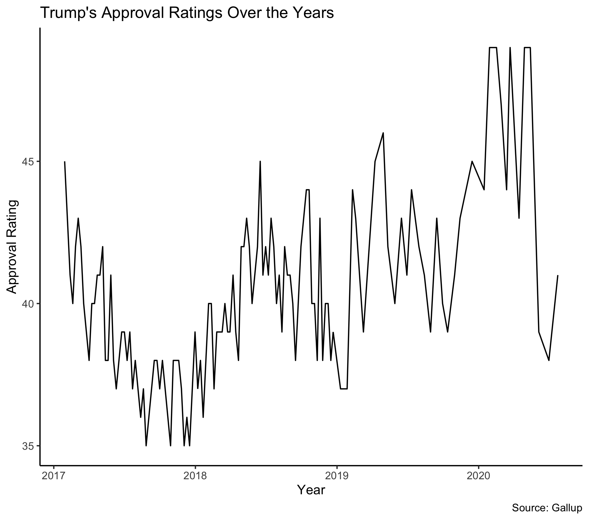
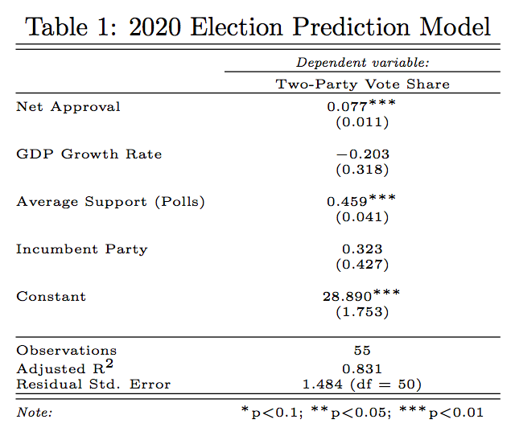

# 10/4 - How does Incumbency Advantage Affect Election Results?

## Overview

Given that the election is soon, it is important that we understand the advantages and disadvantages of incumbency. Some advantages of incumbency include more media coverage, "pork" benefits, and access to campaign finance . However, there are a couple of disadvantages: incumbency might not matter if the nation is already polarized, there is incumbency fatigue, and many may blame the incumbent if the nation is under a recession or disaster. Since incumbency is also a fundamental, we can use incumbency as an indicator for part of a larger prediction model for the 2020 election. Below I will demonstrate the role of incumbency in my model. 

## Analyzing Trump's approval ratings

**Figure 1**

Before I dig into my model, it is important that we look at Trump's approval ratings over the years. The president's approval ratings is clearly very volatile, rapidly changing throughout time. It is important to note that his approval rating was at an all time high in early 2020, which many would argue because of his role in a booming economy. However, after the president's failure to manage the Covid pandemic, his approval ratings have sharply decreased well within months. His approval ratings seem to be steadily increasing now, however, perhaps because the nation is slowly adjusting to the new atmosphere of social distancing and safety precautions. 

## Presenting our prediction model

In class, we learned about Alan Abramowitz’s [time-for-change model](https://pollyvote.com/en/components/models/retrospective/fundamentals-plus-models/time-for-change-model/), which is a classic model of incumbency and had a true out-of-sample PV prediction error of 1.7%. It also correctly predicted  Trump to win the election in 2016. While I could have created a time-for-change model, I believe it relied too much on fundamentals. Perhaps I was taken away too much by Nate Silver's FiveThirtyEight model, but I agree with Silver in that fundamentals are overrated: they are very volatile and the relationship between economic conditions and incumbent party's performance remains noisy, making it hard to predict future elections. Thus, like Silver, to account for this noise, I decided to add polling support as an indicator for my prediction model. Polling support is not a volatile indicator and has been proven to be a reliable indicator, given the success of FiveThirtyEight's prediction model. 

Thus, my prediction model is essentially a time for change model with a twist. I will be looking at how net approval, GDP Growth rate in Q2, incumbency, and average polling support affect the incumbent's two party vote share. After running a linear regression of my model, the table below represents key statistics, such as adjusted R-square and coefficients of predictor variables. 

From our table above, we can see that average support from polls and net approval seems to be the most signficiant predictors as their p-values appears to be the lowest. Their low p-values also lends credibility to Silver's argument that polling support is a significant predictor for elections. Furthermore, we can also see that the adjusted R-square is **0.831** and the Residual Std. Error is **1.484**. 

## Analyzing our prediction model

To analyze this model, we will look at the model's predictive ability on an incumbent's two-party vote share based on their in-sample and out-of-sample error. Below are key information:

+ For in-sample fit, the R-squared value is **0.843**. 
+ For in-sample fit, MSE is **1.415**.
+ The mean difference (leave-one-out validation) between our prediction and the true value is **-2.651**.
+ Mean out-of-sample Error is **3.015**.

Given these values, it appears that this prediction model may not be super accurate because the mean out-of-sample error is quite high and the average difference between our prediction and true value is -2.651, which is also high. It would clearly be better if these numbers were smaller, but, nevertheless, the model is something that can be improved upon. 

## Predicting the election

After running our model, our prediction for 2020 is that Trump's two-party vote share will be **49.79%** with a 95% confidence interval of **(42.976, 56.602)**. The prediction is close to 50%, which can be possible in the actual election. I think by adding polling support to my model, the prediction is higher than what would be for the time-for-change model. This is because if we look at the time-for-change model's predictors, it is safe to assume that the Covid pandemic has signficantly played an impact on the economy and Trump's overall approval ratings. However, the time-for-change model fails to account for ardent supporters of Trump and undecided voters that may ultimately vote for Trump. By adding polling support as an indicator, we are essentially accounting for this group of people. Thus, we may see an increase in Trump's predicted two-party vote share as a result. 
