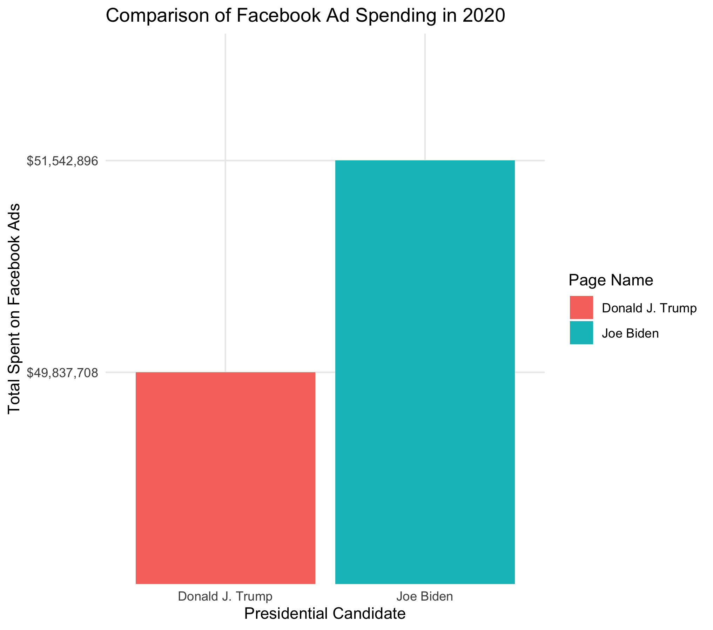
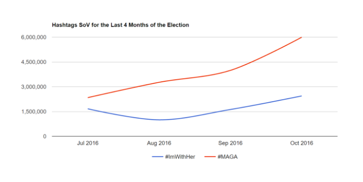

# 10/11 - Analyzing the Effects of Social Media on Political Campaigns

## Overview
Presidents have been using numerous of advertisements to engage with the American people. One type of ad that presidential candidates have been using greatly is social media ads. Social media ads were not always so popular back in the day because not everyone was on social media. Now, however, social media has become so ingrained in society that candidates will look at any opportunity to get their name on services like Facebook and Twitter. For the purpose of this blog, we will look at how much political campaigns spend on social media advertisements and social media's influence on elections. 

## How much do political campaigns spend on social media advertisements?

Figure 1. 

Sourced from the [Wesleyan Media Project](https://mediaproject.wesleyan.edu/releases-100120/#data), Figure 1 indicates the comparison in spending between President Trump and Presidential Candidate Joe Biden on Facebook advertisements. While there are other social media that both candidates use to promote their campaigns, such as Twitter and Instagram, Facebook is generally the most popular social media for advertisements. There are three key pieces of information we can gather from this figure:

+ Biden has spent **$1,705,188** more than Donald Trump on Facebook Ads.
+ While Biden has spent more on Facebook ads than Donald Trump, the **preisdent is a more active user on social media**.
+ The fact that both candidates have spent close to **$50 million on Facebook ads** indicates that both candidates value social media advertisements fairly high.

While Biden has spent more on advertisements on Facebook than Trump, Trump is a more active user on social media. It would be interesting to argue if Trump's presence on social media can be looked upon as a form of advertisement in itself. It possibly may be the case that Donald Trump has spent less than Biden on social media advertising because the president already knows his tweets and posts do enough to solidify his political base. 

## Social media's influence on presidential elections

Let's analyze the effects of social medial on presidential elections. While there is limited data on social media spending by candidates, we can look at the 2016 election to get an estimate of how the election might pan out in 2020. 

Figure 2.

According to Figure 2 (sourced from a [Medium article](https://medium.com/tow-center/a-final-data-driven-look-at-trump-v-clinton-on-social-media-7ea9bb747982)), it can be seen that Trump **#MAGA** became very popular as the election neared. 

+ This trending hashtag might have helped Trump, because it not only **boosted his popularity** but it also served as a constant reminder of what Trump's campaign is about. 
+ Another interesting point about this figure is that Trump's use of social media is intself an advertisement of his campaign because instead of having to present his slogan through posters, tv ads, and other means, Trump can reach more people through social media. Thus, social media as an advertising platform can possibly reach more people especially fi the posts are created for the candidate's account

## How social media may influence the 2020 election?

