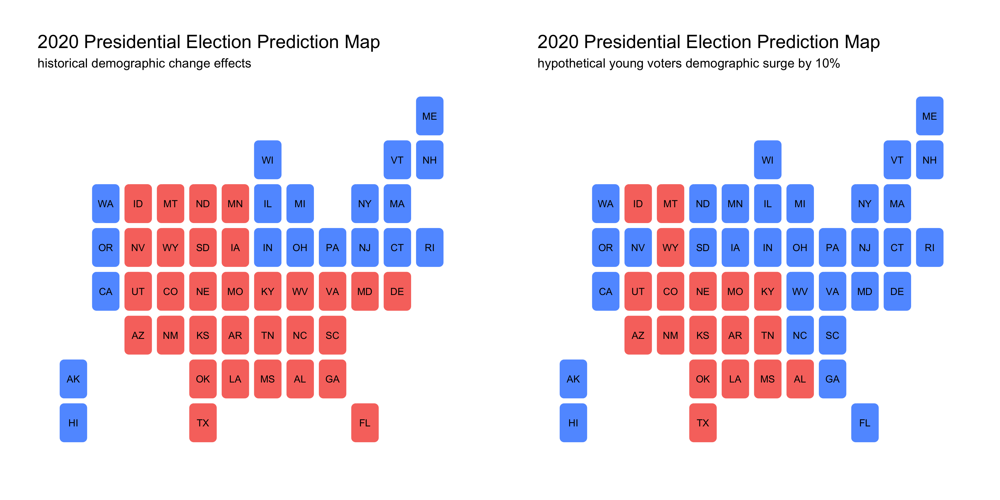

# 10/18 - The Effect of Demographic Changes on Elections

## Overview

Different political parties typically have different voter demographics. For example, minorities are more likely to vote democrat while white people are more likely to vote republican. Moreover, demographics can also be mobilized during election cycles. For example, in light of the BLM movement, it is possible that black voters are more likely to [mobilize](https://fivethirtyeight.com/features/the-partisan-gender-and-generational-differences-among-black-voters-heading-into-election-day/) and vote for a democratic candidate. In this project, we will look at how surges in certain demographic blocs will affect democratic vote share. From a recent study from [Pew](https://www.pewresearch.org/methods/2020/09/08/democrats-made-gains-from-multiple-sources-in-2018-midterm-victories/), it seems that changes in demographic blocs for african americans, hispanics, asians, females, and young voters tend to have a signficant impact on democratic popular vote share. Thus, we will pay close attention to the changes in these particular demographic blocs. 

## Historical demographic effects

According to Table 1, we can see how changes in demographic blocs affect popular vote share for democrats under a linear model. It appears that the black and female vote play a significant impact on democratic vote share. For example, an increase in one percent of african americans voting increases democratic popular vote share by around **5.7%**. An increase in one percent of females voting increases democratic popular vote share by around **7%**. Evidently, both changes in demographic blocs for black people and females have a p-value less than 0.01 and remain significant. 

## Prediction model with hypothetical changes in key demographics

Let's now turn to how hypothethical changes in key demographics affect election outcomes. We will thus look at how surges among particular demographic blocs impact democratic vote share in each state. We will compare these surges to historical demographic effects. 

+ Given the signficance of the black vote, let's look into how a 10% surge among black voters may impact the democratic popular vote share. Considering the impact of the BLM movement and rise of Trump's racist rhetoric, there is a possibility that more eligible black voters will turnout to see a shift in power.
+ If we were to see a 10% surge in the black voting population, we would see drastic effects on democratic popular vote share. A lot of southern states would be predicted to become blue, which is something to take note of. 

+ The change in the female demographic bloc seems to have the most signficant impact on democratic vote share. This may be because females are a high proportion of the population in America. Additionally, given the fact that Biden chose a female vice president and its impact on suburban moms, it may be possible that we will also see a high voter turnout for females. 
+ A 1% surge in female voters also has a signficant impact on democratic vote share. I did not choose to use a 10% hypothetical surge as this would likely mean nearly all states would be blue, which would not really tell much informatio about how a surge in female voters will impact the election. Nonetheless, a 1% surge seemed to also have a significant impact although not as many southern states have shifted to blue. 

+ The last plot we will look at is how a 10% surge in young voters will affect democratic vote share in 2020. Given the rise of the progressive movement, it is also likely that there may be an increase in voter turnout among young voters. 
+ A surge in young voters predicts that democrats are more likely to win states in the Great Plains region. This is quite interesting as there are fewer southern states that turned blue when we see a surge among young voters. 

## Conclusion

It is interesting to note 

 