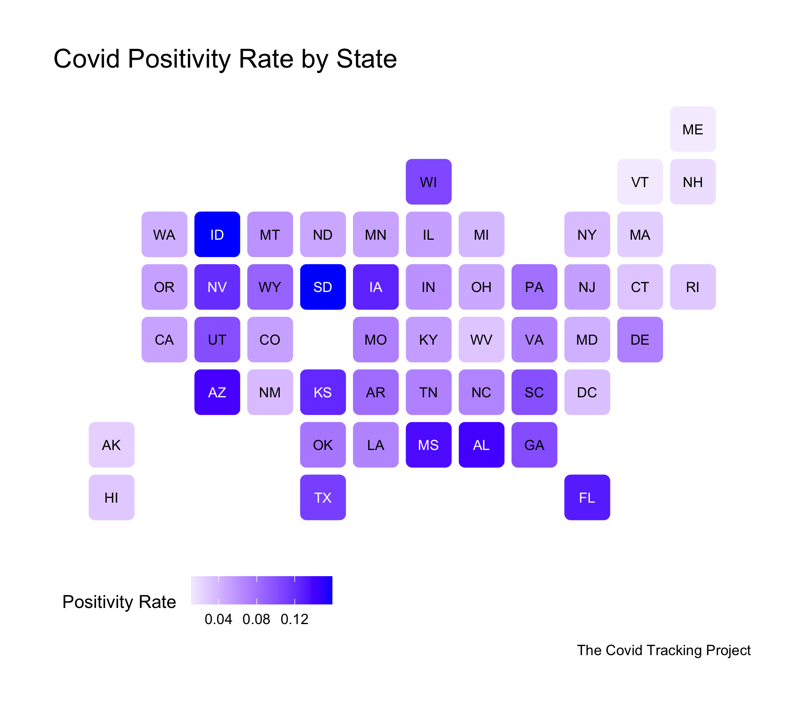
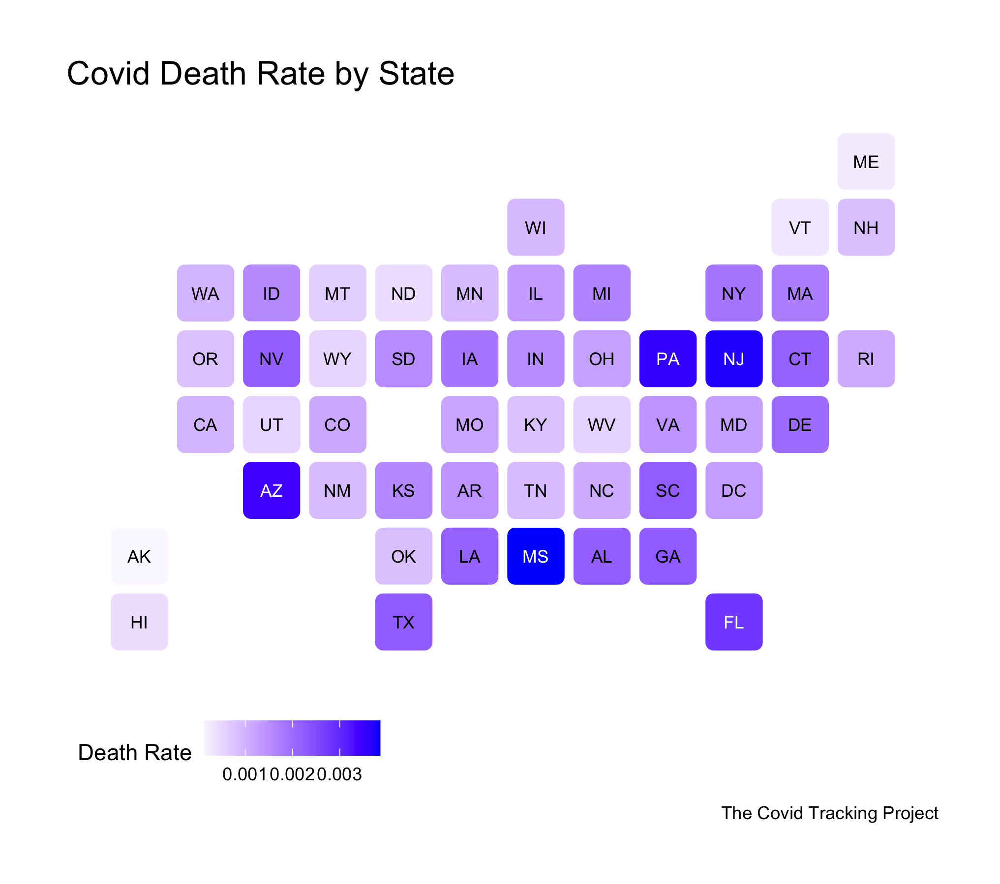
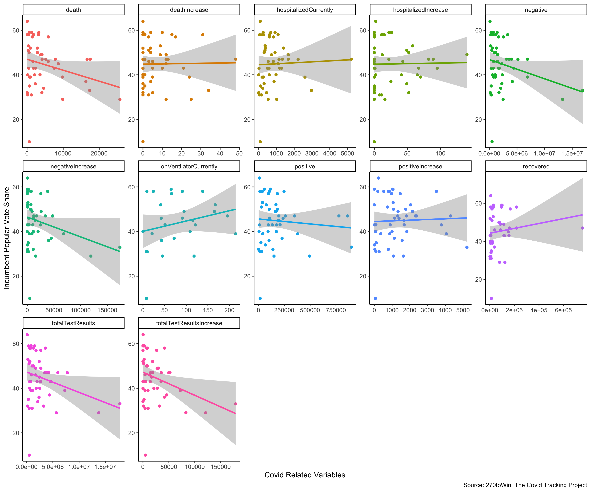

# 10/25 - The Effect of Covid-19 on the 2020 Election

## Overview

2020 has been hit the hardest by Covid-19. In fact, Covid-19 has been a relevant apolitical shock that can potentially have an impact on the upcoming election. Considering Trump's mismanagement of handling the virus and the pandemic being the core theme during the recent presidential debates, one might ask if the Covid-19 pandemic is a possible shock that might affect the general election. To further understand if the Covid-19 is a shock, we can look at the relationship between the effects of the Covid-19 pandemic and polling averages for states. 

## Covid Death Rates and Positivity Rates By State

Figure 1.

Figure 2.

Before we delve into how the pandemic might affect Trump's vote share, we should pay attention to how the pandemic is affecting states in general.
+ According to Figure 1, we can see that Covid positivity rate varies by state although it is quite high for states like **Idaho and South Dakota**. 
+ While the positivity rate is generally less than **0.15**, some states are worse off than others. It seems that the midwest and south have higher positivity rates than the northeast for example. 
+ According to Figure 2, the death rate is generally below **0.005**. 
+ **States with high positivty rates also seem to have high death rates as well.**

## Analyzing the Effects of the Covid Pandemic on Trump's Vote Share

Figure 3.

Now that we have a better understanding of what the pandemic is like in America, we can look at how the pandemic might affect Trump's vote share. In order to analyze such effects, I looked at data from The Coronavirus Tracking Project and 270toWin. 270toWin had recent state polling averages from legitimate pollsters. 

+ According to Figure 3, we can actually see that important Covid related variables like deathIncrease, positiveIncrease, and hospitalizedIncrease are **weakly correlated** with Trump's vote share.
+ It's interesting to note that negativeIncrease had a negative correlation with Trump's vote share. This could be because states that had a large increase of negative cases were states that are more liberal in nature. 

## Conclusion

Based on Figure 3, it seems like the Coronavirus pandemic, a potential nonpolitical shock, did not seem to have much of an impact on Trump's vote share. This is very interesting because the Coronavirus pandemic has been the hot topic in America and its media. However, it's tough to say how much of an impact the pandemic might affect Trump's predicted vote share because the the pandemic did have indirect effects on things like the economy, which is a fundamental that is generally a predictor for the election. In addition, some states are potentially ardent supporters for Trump even though they may have a high number of coronavirus cases, which may explain the weak correlations seen in Figure 3. Given that election periods have never really had something like the Coronavirus pandemic, I am intrigued by how everything will play out at the end. 

