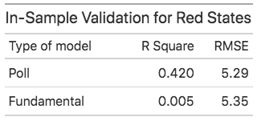

# 11/1 - Predicting the 2020 Election

## Overview

The time has come! It is time to make our final prediction for the 2020 Presidential election. The upcoming election will be a very unique one. America has not witnessed events like the Coronavirus pandemic and civil unrest from the death of George Floyd in a long time, which may impact voting behaviors. Furthermore, the pandemic has played detrimental effects on the economy, also possibly impacting voting behaviors. In this blog, I will talk about the model we will use to forecast the 2020 election. 

## Models Logistics

+ I am using a state model for my prediction.
+ My model uses data filtered for Republican candidates.
+ To adjust for overfitting, I decided to separate America into three categories - red states, blue states, and battleground states - for my model. My grouping was based on how FiveThirtyEight grouped states. 
  + Red States - AK, IN, KS, MO, AL, AR, ID, KY, LA, MS, ND, OK, SD, MT, TN, WV, WY, SC, UT, NE
  + Blue States - CO, VA, CA, CT, DE, HI, IL, MD, MA, NJ, NY, OR, RI, VT, WA, ME, NM, NH
  + Battleground states = FL, IA, OH, GA, NC, MI, MN, PA, WI, NV, AZ, TX
+ While it is better to model by county, there was little data to extract a model from a county basis. Thus, I decided to instead use my model for each of the three groups. 
+ In addition, we will be assuming the District of Columbia is a blue state and a projected democratic winner. 
+ The sources for my data are the following:
  + Historical polling, approval, and turnout data was based on data given from class
  + Historical and present economic data was sourced from the Bureau of Economic Analysis
  + Present polling and approval data was based on FiveThirtyEight's forecast data

## Poll Model

```
R_pv2p ~ avg_pollyr
```
+ R_pv2p represents Republican vote share
+ avg_pollyr represents average polling support for Republican candidate

+ The first model I created was a poll model, which is a linear model. 
+ The formula of the model uses average poll support for a republican as a predictor with a response variable that is Republican vote share and the model uses historical state-level polling data from 1972 to 2016. 
+ Furthermore, the linear model was used to predict Trump's vote share in each state for 2020 using poll averages from 10/31/20.  


Figure 1.

The results of this model is seen in Figure 1. Based on this model, **Biden is expected to win with an electoral count of 310 votes to Trump's 228 votes**. 

I decided to use a poll model because I learned from Nate Silver that polls are very good predictors of the election. While in 2016, polls were not as representative of the actual results, it is important that many pollsters have now improved in their methods. Now many pollsters are asking less biased questions and polling at more areas.

## Fundamental Model
```
R_pv2p ~ GDP_growth_qt + turnoutpct_change + net_app
```
+ GDP_growth_qt represents Q2 GDP growth rate
+ turnoutpct_change represents the percent change in voter turnout from the previous election
+ net_app represents net approval for Republican candidate

+ The next model I want to look at is a fundamental model, which is a linear model. 
+ Given the success of the Abromowitz’s Time for Change Model, I thought it was important to include the indicators of that model as part of my fundamental model. Thus, I used Q2 GDP growth and the president's approval rating as my predictors. I also did not add incumbent party as an interaction variable since I am already looking at incumbent's vote share and the Republican party. 
+ However, I did not just use those two predictors: I also used the change in turnout percentage as another predictor. I decided to add change in turnout percentage as another predictor, because I thought it was important that 150 million people are planning to vote (about 11 million more than 2016) and [turnout is already high](https://www.vox.com/2020/11/1/21543381/92-million-people-early-voting-turnout-2020). 
+ Furthermore, I considered change in turnout percentage as a fundamental because I considered it as part of political data. 
+ The fundamental model was used to predict Trump's vote share in each state for 2020 using Trump's recent 2020 approval ratings and each state's 2020 Q2 GDP growth rate. 
+ Given that we don't have information on change in turnout percentage, I decided to make change in turnout percentage 18% for each state as many news outlets are predicting around a huge [increase in voter turnout](https://www.npr.org/2020/10/26/927803214/62-million-and-counting-americans-are-breaking-early-voting-records), possibly around a fifth higher for some states. 


Figure 2.

The results from this model is seen in Figure 2. **Based on this model, Biden is expected to win with an electoral count of 402 votes to Trump's 136 votes**. 

I noticed that using the fundamental model has played a significant impact on battleground states in comparison to the polls model. I noticed many battleground states like Texas and Georgia have become blue from using the fundamental model. 

## Ensemble Model
```
Trump vote share = 0.96*Poll + 0.04*Fundamental
```

Now that we have our poll model and fundamental model, I decided to then use an ensemble model where **I weighted the poll model by 0.96 and the fundamental model by 0.04**.
+ I decided to weigh the poll model very high using the logic of FiveThirtyEight's model. There is very little reliable data relating to fundamentals and the relationship between economic conditions and incumbent party's performance remains noisy, making it hard to predict future elections especially for 2020. 
+ In addition, according to [Abramowitz](https://www-cambridge-org.ezp-prod1.hul.harvard.edu/core/services/aop-cambridge-core/content/view/47BBC0D5A2B7913DBB37FDA0542FD7E8/S1049096520001389a.pdf/its_the_pandemic_stupid_a_simplified_model_for_forecasting_the_2020_presidential_election.pdf), "There are good reasons to expect that in 2020, two of the model’s (TFC model) predictors—the change in real GDP in the second quarter and the time-for-change dummy variable—will not perform as they normally do." However, I still think the fundamentals can still play an impact on the election, which is why I weighed them but very little.


Figure 3.

Just like the FiveThirtyEight model, I relied heavily on polling data. The ensemble model predicts Biden to win with 310 electoral votes and Trump to lose with 228 votes. While there are not necessarily any glaring predictions for a state, it is important to understand that there is uncertainty with this model, which I will talk about later on. 

## Validation of Models


Figure 4. 


Figure 5. 


Figure 6. 

In this section, I will discuss the validation I used for my models. 

+ First off, for the in-sample fit, the statistics are shown above for each type of state. We can see that the poll model typically has a higher R-Square than the fundamental model for all types of states. It is interesting to note, however, that while the R-square is quite high for the poll model for blue states, it's RMSE is pretty high. 
+ We can see that red states have a high RMSE using the poll model for the in-sample fit. 


Figure 7. 

+ For out-of-sample validation, I essentially performed cross-validation. I randomly divided the data into 2 subsets and used one subset for fitting the model and used the other for testing the model performance. I then repeated this procedure 1,000 times. 
+ For out-of-sample validation of the ensemble model, I calculated the predictive error by weighing the predictive errors from the poll and fundamental models with the same weights as the ensemble model. Given the characteristics of the model and how I created it, I could not really do an out-of-sample validation like how I did for the poll and fundamental models, so I thought this method I outlined can potentially work.
+ The predictive error of cross-validation seems to mainly be around 1.6 - 1.8 for all models except that it is quite high for Red states using the poll model and ensemble model.


## Predictability of Ensemble Model


Figure 8. 

+ According to Figure 8, I have plotted the 95% prediction intervals for Trump's predicted vote share in each state based on the ensemble model, giving us the uncertainty of our model.
+ According to the model, all the battleground states cross the 50% threshold and are near the 50% vote share, meaning those states are most likely to be swing states. 
+ The above figure also shows the predictability of the model on a state by state basis. 


## Sensitivity Analysis
I also decided to do a sensitivity analysis on our model. 

Figure 9. 
+ Thus, I essentially changed the weights of the model. I decided to weigh the Poll model by 0.95 and the fundamental model by 0.05. The results are in the figure above. 
+ We can see that by decreasing the weight of the poll model by one percent and increasing the weight of the fundamental model by one percent, Biden wins Texas. This shows that the fundamental model heavily favors the democratic party. This could be partly because Q2 GDP growth rate has been historically low as well as Trump's approval ratings for some states, which may impact a Republican's odds at winning for that state. 
+ Using the sensitivity analysis for the ensemble model, it was hard to get a prediction of when Trump wins the election. If we use a weight greater than 0.96 for the poll model and a weight less than 0.04 for the fundamental model, we have the same predictions as the current ensmeble model of 0.96(Poll) + 0.04(Fundamental). 

## Conclusion

My final prediction is using the results from our ensemble model, which means that **Biden is projected to have 310 electoral votes while Trump is projected to have 228 electoral votes**. The **95% prediction interval for Biden is 144 electoral votes to 432 electoral votes** based on Figure 8. Given the nature of the ensemble model, there is quite a lot of uncertainty with this model, particularly with battleground states. While the battleground states did have smaller prediction intervals than other states according to figure 8, they have been very close to 50%. This means they are quite easy to flip, or swing, come election time. 

I prefer using the ensemble model because it weighs the poll model more heavily, especially since fundamentals tend to be noisy predictors as the election nears. However, given the impact of the Coronavirus pandemic and the expected record-breaking voter turnout, I do expect fundamentals to have some sort of impact on the election. 

Additionally, I am interested to see how bias my models are in general after we find out the actual results of the election. There is a chance that polling data might be biased and could repeat what happened in 2016. Given that my polling model and ensemble model mainly represent what polls are saying, it would be interesting to see if the poll and ensemble model are very different from the actual results. This might tell America that we again need to do a better job in polling our citizens, especially since polling was heavily flawed in 2016. 


